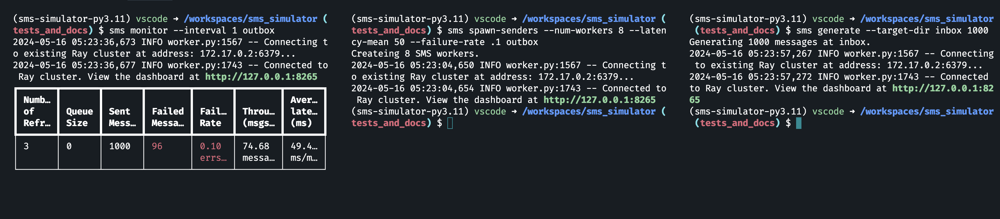

[](https://github.com/pre-commit/pre-commit)

[](https://github.com/astral-sh/ruff)

[](https://vscode.dev/redirect?url=vscode://ms-vscode-remote.remote-containers/cloneInVolume?url=https://github.com/sullivancolin/sms_simulator)

# SMS Simulator
The objective is to simulate sending a large number of SMS alerts, like for an emergency alert service. The
simulation consists of three parts:

1. A producer that generates a configurable number of messages (default 1000) to random phone numbers.
Each message contains up to 100 random characters.
2. A configurable number of senders who pick up messages from the producer and simulate sending
messages by waiting a random period of time distributed around a configurable mean. Senders also have
a configurable failure rate.
3. A progress monitor that displays the following and updates it every N seconds (configurable):
Number of messages sent so far
Number of messages failed so far
Average time per message so far

One instance each for the producer and the progress monitor will be started while a variable number of
senders can be started with different mean processing time and error rate settings.

## Getting Started

### System Requirements
Building the project and installing its dependencies requires an installation `Python 3.11` along with the [`poetry`](https://python-poetry.org/docs/) project workflow tool.

### Installation
To create a virtual environment an install all the dependencies for the project run
```sh
$ poetry install
```
Alternatively, this repository contains a [devcontainer](https://code.visualstudio.com/docs/devcontainers/containers) configuration that will allow you to open the project inside a Docker environment with all the prequisites already set up.  If you have Docker installed, use VSCode and have the devcontainer extension installed, simply clicking on the above badge should launch the build process for you. Otherwise, if you clone the repository and open the workspace in VSCode you should be prompted to "Reopen in Container".  [Pycharm](https://www.jetbrains.com/help/pycharm/connect-to-devcontainer.html) may also support similar workflow

## Workspace Commands
There is a Makefile with convenient targets for running tasks in the project like running tests, building and viewing the documentation, cleaning up artifacts etc. To view the list of available targets simple run:
```sh
$ make
```

## Starting Ray
The Queue and Sender workers are ochestrated using the [ray](https://docs.ray.io/en/latest/) multiprocessing and distributed computing framework. Before running any of the SMS simulator processes the ray runtime must be started in the background.  To start it run
```sh
$ make start-ray
```
or
```sh
$ poetry run ray start --head
```
## Stoping Ray
To stop the ray runtime process run
```sh
$ make stop-ray
```
or
```sh
$ poetry run ray stop
```
If you wish to change the configuation paremeters of any running SMS sender processes or Queue, it is necessary to stop and restart the ray runtime before respawning the similator.

## CLI interface for the sms service simulator
The main interface for interacting with the sms simulator is via a command line script named `sms`, which has 3 sub commands `generate`, `spawn-senders`, and `monitor`

```

 Usage: sms [OPTIONS] COMMAND [ARGS]...

 CLI interface for the sms service simulator.

╭─ Options ───────────────────────────────────────────────────────────────────────────────────────╮
│ --version             -v        Print the current version.                                      │
│ --install-completion            Install completion for the current shell.                       │
│ --show-completion               Show completion for the current shell, to copy it or customize  │
│                                 the installation.                                               │
│ --help                          Show this message and exit.                                     │
╰─────────────────────────────────────────────────────────────────────────────────────────────────╯
╭─ Commands ──────────────────────────────────────────────────────────────────────────────────────╮
│ generate        Generate N SMS messages and add them to the queue.                              │
│ monitor         Monitor SMS progress.                                                           │
│ spawn-senders   Send SMS messages.                                                              │
╰─────────────────────────────────────────────────────────────────────────────────────────────────╯
```
The command line script is only installed inside the virtual environment so you will need to prefix all invocations of `sms` with `poetry run` as in
```sh
$ poetry run sms generate
```
Alternatively, you may activate the virtual environment in a terminal session with `poetry shell` to avoid needing to use the prefix.

To get instructions on how to use any of the subcommans just run `sms <sub-command> --help` for more detailed information.

## Example Usage
The 3 processes may be started in any order, but will need separate terminal sessions for convenience.

### 1. Start the Monior Process
The following will display the monitor metrics updating every 1 second and looking for completed work in the `outbox` directory
```sh
$ sms monitor --interval 1 outbox
```

### 2. Start the pool of SMS sender workers
THe following will start 8 worker processes in the background that will pull work off the queue in paralell process it with corresponding avg latency and error rate and place the completed work in the `outbox` directory.
```sh
$ sms spawn-senders --num-workers 8 --latency-mean 50 --failure-rate .1 outbox
```
## 3. Generate SMS Messages
The following will create 1000 sms messages with random phone numbers and messages between 1 and 100 characters long, write them as json files in the `inbox` directory, and add them to the queue for consumption by the senders
```sh
$ sms generate --target-dir inbox 1000
```

### Sample output

